# チケット管理システム v2.3

文化祭やイベント向けの座席予約・チェックイン・当日券発行・最高管理者機能を行う高度な Web アプリケーションです。Google Apps Script（GAS）で構築されたバックエンドと、完全オフライン対応・監査システム・エラー分析機能を備えたフロントエンドから構成される、エンタープライズレベルの座席管理システムです。

## 🆕 v2.3 の新機能

### 🔍 監査システム（Audit System）
- **全操作の記録**: すべての座席操作を詳細に記録
- **リアルタイム同期**: 監査ログの自動同期（10秒間隔）
- **専用スプレッドシート**: 監査ログ専用の一元管理
- **エラー追跡**: システムエラーの詳細な追跡と分析

### 🛠️ エラー分析・診断システム
- **自動エラー検出**: クリティカル・ネットワーク・同期エラーの自動検出
- **パターン分析**: エラーパターンの分析と推奨事項の生成
- **システム診断**: 包括的なシステム健康状態チェック
- **自動修復**: 検出された問題の自動修復機能

### 📊 システム監視
- **健康状態監視**: リアルタイムでのシステム状態監視
- **メトリクス収集**: パフォーマンス・エラー・同期状況の詳細メトリクス
- **アラート機能**: 問題発生時の自動アラート
- **診断レポート**: 詳細なシステム診断レポートの生成

## 📋 目次

- [🚀 主な機能](#-主な機能)
- [🏗️ システム構成](#️-システム構成)
- [🔍 監査システム](#-監査システム)
- [🛠️ エラー分析・診断システム](#️-エラー分析診断システム)
- [📊 システム監視](#-システム監視)
- [🎯 動作モード](#-動作モード)
- [📱 画面構成](#-画面構成)
- [🔐 最高管理者モード](#-最高管理者モード)
- [🎫 当日券機能](#-当日券機能)
- [⚙️ セットアップ手順](#️-セットアップ手順)
- [🎮 使い方](#-使い方)
- [📖 当日運用マニュアル](#-当日運用マニュアル)
- [🔧 設定とカスタマイズ](#-設定とカスタマイズ)
- [🛡️ セキュリティ](#️-セキュリティ)
- [📊 アーキテクチャ](#-アーキテクチャ)
- [🔄 技術仕様](#-技術仕様)
- [📁 ファイル構成](#-ファイル構成)
- [🚨 トラブルシューティング](#-トラブルシューティング)
- [📚 使用例](#-使用例)
- [🔮 今後の拡張予定](#-今後の拡張予定)
- [⚡ システム最適化](#-システム最適化)
- [👨‍💼 管理者モード完全操作ガイド](#-管理者モード完全操作ガイド)
- [🌐 API URL分散設定ガイド](#-api-url分散設定ガイド)
- [🧪 DEMOモード](#-demoモード)

---

## 🚀 主な機能

### 基本機能
- **座席可視化と予約**（通常モード）
- **予約済/確保/チェックイン待ち/チェックイン済のステータス表示**
- **自動更新**（座席マップの定期リフレッシュ）と手動更新
- **URL管理システム**：複数API URLの自動ローテーションとフェイルオーバー

### 管理者機能
- **管理者モード**：予約済/確保席の複数席同時チェックイン
- **当日券モード**：空席の自動割当（1〜6枚）
- **最高管理者モード**：座席データのC、D、E列を自由に編集可能

### オフライン対応機能（v2.0）
- **完全オフライン動作**：インターネット接続なしでも全機能が利用可能
- **ローカル処理**：キャッシュされた座席データでの即座な操作
- **自動同期**：オンライン復帰時に操作を自動でサーバーに反映（バックグラウンド同期間隔: 約15秒）
- **当日券オフライン発行**：オフライン時でも当日券を発行・表示
- **Service Worker**：ページとアセットのオフラインキャッシュ

### 監査・分析機能（v2.3）
- **全操作記録**：座席予約・チェックイン・当日券発行・編集操作を詳細記録
- **リアルタイム監査**：操作の即座な監査ログ記録と同期
- **エラー追跡**：システムエラーの詳細な追跡と分析
- **パターン分析**：エラーパターンの自動分析と推奨事項生成
- **システム診断**：包括的なシステム健康状態チェック
- **自動修復**：検出された問題の自動修復機能

### URL管理・負荷分散機能（v2.1）
- **複数API URL対応**：使用数上限回避のための分散処理
- **自動ローテーション**：5分間隔でのURL自動切り替え
- **ランダム選択**：手動更新時の確実なURL変更
- **フェイルオーバー**：API呼び出し失敗時の自動切り替え
- **アニメーション通知**：URL変更時の視覚的フィードバック
- **URL情報表示**：現在使用中のAPI URLの表示

### モード管理
- **サイドバーからのモード切り替え**（通常/管理者/当日券/最高管理者）
- **パスワード認証**によるセキュリティ
- **リアルタイムモード表示**

---

## 🏗️ システム構成

### フロントエンド（v2.2最適化版）
- 静的ファイル群（HTML/CSS/ES Modules）。ビルド不要。
- モジュラー設計で機能別にファイルを分割
- レスポンシブデザイン対応
- **OptimizedLoader**：依存関係を考慮した並列モジュール読み込み
- **APICache**：インテリジェントキャッシュシステム
- **UIOptimizer**：イベント処理とレンダリングの最適化
- **PerformanceMonitor**：リアルタイムパフォーマンス監視
- **オフライン同期システム（v2.0）**：完全オフライン動作を実現

### バックエンド
- GAS を JSONP で呼び出し（`optimized-api.js`）
- CORS を回避しつつ、`callback` で応答を受け取ります
- **URL管理システム**：複数API URLの自動管理とローテーション
- **フェイルオーバー機能**：API呼び出し失敗時の自動切り替え
- **オフライン委譲機能**：オフライン時の操作をローカル処理に委譲
- **キャッシュ統合**：API呼び出しの重複排除と最適化

### データストア
- Google スプレッドシート
- `SpreadsheetIds.gs` で対象スプレッドシートを公演別に切替
- 最高管理者モードでは座席データの直接編集が可能
- **ローカルキャッシュ**：座席データのオフライン保存と同期

### システムアーキテクチャ（v2.3監査・分析対応版）
```mermaid
graph TB
  subgraph "フロントエンド（v2.3）"
    A[OptimizedLoader]
    B[OfflineSyncV2]
    C[Service Worker v2]
    D[APICache]
    E[Local Storage]
    F[AuditManager]
    G[ErrorAnalyzer]
    H[PerformanceMonitor]
  end
  
  subgraph "通信層（最適化）"
    I[OptimizedGasAPI]
    J[URL管理システム]
    K[オフライン委譲]
    L[自動同期（10秒間隔）]
  end
  
  subgraph "バックエンド（v2.3）"
    M[GAS Web App]
    N[API ルーター]
    O[ビジネスロジック]
    P[監査ログAPI]
  end
  
  subgraph "データストア"
    Q[Google Spreadsheet]
    R[座席データ]
    S[ログデータ]
    T[監査ログ専用スプレッドシート]
  end
  
  A --> B
  A --> D
  A --> F
  A --> G
  A --> H
  B --> C
  B --> E
  D --> I
  I --> J
  I --> K
  K --> B
  I --> M
  M --> Q
  F --> P
  P --> T
  B --> L
  L --> M
  G --> F
  H --> A
```

---

## 🔍 監査システム

### 概要
システム全体の操作を詳細に記録し、リアルタイムで監査ログを管理する高度な監査システムです。

### 主要機能

#### 1. 全操作記録
- **座席予約**: 予約者情報、座席番号、時刻を記録
- **チェックイン**: チェックイン対象、実行者、時刻を記録
- **当日券発行**: 発行枚数、座席番号、発行方法を記録
- **座席編集**: 最高管理者による編集内容を詳細記録
- **モード変更**: 認証情報、変更時刻を記録

#### 2. リアルタイム同期
- **自動同期**: 10秒間隔での監査ログ自動同期
- **専用スプレッドシート**: 監査ログ専用の一元管理
- **エラー処理**: 同期失敗時の自動再試行（最大3回）
- **データ整合性**: 同期失敗時のログ保護

#### 3. エラー追跡
- **グローバルエラー**: JavaScript エラーの自動キャッチ
- **Promise拒否**: 未処理のPromise拒否を追跡
- **API呼び出しエラー**: GAS API呼び出し失敗を記録
- **同期エラー**: 監査ログ同期失敗を追跡

### 監査ログの構造
```javascript
{
  id: "一意のID",
  timestamp: "2024-01-01T12:00:00.000Z",
  operation: "seat_reservation",
  fileName: "seats.html",
  identifier: "seats.html-見本演劇-1-A",
  auditLogSpreadsheetId: "監査ログ専用スプレッドシートID",
  originalSpreadsheetId: "座席データスプレッドシートID",
  group: "見本演劇",
  day: "1",
  timeslot: "A",
  mode: { mode: "normal", isDemo: false },
  userAgent: "ブラウザ情報",
  url: "現在のURL",
  deviceInfo: { /* デバイス情報 */ },
  details: { /* 操作詳細 */ },
  beforeData: { /* 変更前データ */ },
  afterData: { /* 変更後データ */ },
  error: null,
  stackTrace: null
}
```

### 使用方法
```javascript
// ブラウザコンソールで利用可能
AuditManager.log('custom_operation', { detail: 'カスタム操作' });
AuditManager.getLogs({ operation: 'seat_reservation' });
AuditManager.getStats();
AuditManager.manualSync();
AuditManager.healthCheck();
```

---

## 🛠️ エラー分析・診断システム

### 概要
システムエラーを自動検出・分析し、問題の早期発見と解決を支援する高度な診断システムです。

### 主要機能

#### 1. 自動エラー検出
- **クリティカルエラー**: TypeError、ReferenceError、CreateListFromArrayLike
- **ネットワークエラー**: API呼び出し失敗、タイムアウト、CORS
- **同期エラー**: 監査ログ同期失敗、スプレッドシート接続エラー
- **ストレージエラー**: localStorage容量不足、データ破損

#### 2. パターン分析
- **エラー頻度**: 同じエラーの発生頻度を分析
- **タイムライン**: エラー発生の時間的パターンを分析
- **関連性**: エラー間の関連性を特定
- **傾向分析**: エラー発生の傾向を分析

#### 3. 推奨事項生成
- **即座の対応**: クリティカルエラーに対する緊急対応
- **予防策**: エラー再発防止のための推奨事項
- **最適化**: システムパフォーマンス向上の提案
- **設定調整**: システム設定の最適化提案

### エラー分析レポート
```javascript
{
  totalErrors: 25,
  patterns: {
    critical: 3,
    network: 8,
    sync: 12,
    storage: 2
  },
  criticalIssues: [
    {
      type: 'consecutive_errors',
      severity: 'high',
      description: '連続してエラーが発生しています',
      count: 5,
      recommendation: 'システムの再起動を検討してください'
    }
  ],
  recommendations: [
    {
      priority: 'high',
      category: 'critical',
      action: 'クリティカルエラーの修正',
      description: '3件のクリティカルエラーが検出されました',
      steps: [
        'コンソールで AuditManager.analyzeErrors() を実行',
        'クリティカルエラーの詳細を確認',
        'エラーの発生箇所を特定',
        'コードの修正を実施'
      ]
    }
  ]
}
```

### 使用方法
```javascript
// エラー分析の実行
AuditManager.analyzeErrors();

// システム診断レポートの生成
AuditManager.diagnose();

// 自動修復の実行
AuditManager.autoFix();

// システム健康状態のチェック
AuditManager.healthCheck();
```

---

## 📊 システム監視

### 概要
システム全体の健康状態をリアルタイムで監視し、問題の早期発見と対応を支援する監視システムです。

### 主要機能

#### 1. 健康状態監視
- **全体状態**: healthy / warning / critical / attention
- **コンポーネント別状態**: 各システムコンポーネントの状態監視
- **メトリクス収集**: 詳細なシステムメトリクスの収集
- **リアルタイム更新**: 状態のリアルタイム更新

#### 2. メトリクス収集
- **ログ数**: 総ログ数、同期待ちログ数
- **同期状況**: 同期失敗数、最終同期時刻
- **エラー状況**: 最近のエラー数、エラー傾向
- **パフォーマンス**: レスポンス時間、メモリ使用量

#### 3. アラート機能
- **自動アラート**: 問題発生時の自動アラート
- **閾値設定**: カスタマイズ可能なアラート閾値
- **通知機能**: 問題発生時の通知機能
- **エスカレーション**: 重大な問題のエスカレーション

### 健康状態チェック結果
```javascript
{
  overall: 'healthy',
  components: {
    auditManager: 'healthy',
    autoSync: 'healthy',
    errorTracking: 'healthy',
    storage: 'warning'
  },
  metrics: {
    totalLogs: 1250,
    pendingLogs: 5,
    syncFailures: 0,
    recentErrors: 2,
    lastSync: '2024-01-01 12:00:00'
  },
  recommendations: [
    'ストレージ使用量が80%を超えています。ログのクリーンアップを検討してください。'
  ]
}
```

### 使用方法
```javascript
// システム健康状態のチェック
const health = AuditManager.healthCheck();
console.log('システム状態:', health.overall);
console.log('推奨事項:', health.recommendations);

// 詳細メトリクスの確認
console.log('メトリクス:', health.metrics);
console.log('コンポーネント状態:', health.components);
```

---

## 🎯 動作モード（サイドバー > モード変更）

| モード | 権限 | 機能 | 認証 |
|--------|------|------|------|
| **通常モード** | 一般ユーザー | 座席予約が可能 | 不要 |
| **管理者モード** | 管理者 | チェックイン、座席名表示 | パスワード必要 |
| **当日券モード** | 当日券担当 | 空席自動割当、当日券発行 | パスワード必要 |
| **最高管理者モード** | 最高管理者 | 座席データ編集、当日券発行、全権限 | パスワード必要 |

---

## 📱 画面構成

### メインページ
- `index.html`: 組選択ページ
- `timeslot.html`: 時間帯選択ページ
- `seats.html`: 座席選択・予約ページ（通常/管理者/最高管理者/当日券）
- `walkin.html`: 当日券発行ページ（当日券/最高管理者）

### 共通レイアウト/部品
- `styles.css`: 全体スタイル
- `sidebar.js` / `sidebar.css`: サイドバー、モード切替モーダル、ナビゲーション

### 機能別ファイル
- `seats-main.js` / `seats.css`: 座席マップ表示・予約・チェックイン・最高管理者編集・当日券ナビゲーション
- `walkin-main.js` / `walkin.css`: 当日券発行、枚数選択（±ボタン対応）
- `timeslot-main.js` / `timeslot-schedules.js`: 時間帯選択（フロント固定データ）

### バックエンド（GAS）
- `Code.gs`: API ルーター（doGet/doPost/JSONP 応答含む）と座席・予約・チェックイン・当日券・最高管理者編集処理
- `TimeSlotConfig.gs`: 時間帯設定（GAS 側）
- `SpreadsheetIds.gs`: 各公演のスプレッドシート ID 管理
- `system-setting.gs`: パスワード設定ユーティリティ（最高管理者パスワード含む）

---

## 🔐 最高管理者モードの詳細機能

### 権限と表示
- 管理者モードと同様に座席に名前が表示される
- ヘッダーに「最高管理者モード」の表示（濃い赤色）
- 座席クリック時に視覚的フィードバック（濃い赤色で選択状態表示）

### 座席編集機能
- **任意の座席を選択可能**：ステータスに関係なく全ての座席をクリック可能
- **編集モーダル表示**：座席クリック時にC、D、E列の編集フォームが表示
- **列別編集**：
  - **C列**: ステータス（空、確保、予約済など）
  - **D列**: 予約名・備考
  - **E列**: チェックイン状態・その他
- **確認ダイアログ**：確定ボタンで「本当に変更しますか？」の確認
- **自動更新**：編集後は座席データが自動再読み込みされる

### セキュリティ
- `SUPERADMIN_PASSWORD`によるパスワード認証
- スプレッドシートの直接更新（C、D、E列のみ）

### 視覚的フィードバック
- 選択された座席は濃い赤色（#8B0000）で表示
- 白いボーダーと影で視認性を向上
- 単一選択（他の座席の選択は自動クリア）

---

## 🎫 当日券機能（オンライン/オフライン同等の席選定ロジック）

### アクセス制限
- **ページレベル制限**: 当日券ページ（`walkin.html`）は当日券モードまたは最高管理者モードでのみアクセス可能
- **自動リダイレクト**: 許可されていないモードでアクセスした場合、座席選択ページに自動リダイレクト
- **ボタンレベル制限**: 座席選択画面の当日券ボタンは、許可されたモードでのみ表示・有効化
- **リアルタイム制御**: サイドバーでモード変更時に即座にアクセス制限が適用される

### 発行方法（挙動の統一）
- **一緒（同一行の連続席で確保）**: 行優先 A→E、席番号昇順で同一行の連番を確保（オンライン/オフライン同一）。
- **どこでもよい**: 行優先 A→E、席番号昇順で先頭から必要数を確保（ランダムではなく決定的に統一）。

### 枚数選択
- 1〜6枚の範囲で選択可能
- ±ボタンによる直感的な操作
- 再入防止機能で誤操作を防止

### オフライン当日券発行（改善点）
- **ローカル処理**: オフライン時でもキャッシュされた座席データで当日券を発行
- **座席表示**: オフライン発行時も実際の座席番号を表示（例：`A1 / A2 (ローカル処理)`）
- **自動同期**: オンライン復帰時にローカル予約を当日券として正式登録（`updateSeatData` が一時失敗した場合はキューへ委譲）
- **重複防止**: ローカルで予約した座席をそのまま当日券として登録（新規座席割当なし）
- **当日券用空席データ**: 当日券モード時に約10秒間隔でプルし、ローカル座席キャッシュが空でも補完

---

## ⚙️ セットアップ手順

### 1. スプレッドシート準備
- 各公演（組/日/時間帯）に対応するスプレッドシートを用意
- 座席シート名は `Seats` に統一
- 列レイアウト（`Code.gs` の参照範囲に一致）
  - **A列**: 行ラベル（A〜E）
  - **B列**: 列番号（1〜12、E は 1〜6）
  - **C列**: ステータス（`空`/`確保`/`予約済`）
  - **D列**: 予約名（任意）
  - **E列**: チェックイン（`済` のみ使用）

### 2. GAS デプロイ
- Google Apps Script プロジェクトを作成
- `Code.gs` / `TimeSlotConfig.gs` / `SpreadsheetIds.gs` / `system-setting.gs` を貼り付け
- `SpreadsheetIds.gs` の `SEAT_SHEET_IDS` を公演ごとに正しい ID へ更新
- `system-setting.gs` の `setupPasswords()` を一度実行して、全パスワードを設定
- ウェブアプリとしてデプロイ
  - 実行する関数: `doGet`
  - アクセス権: 全員（匿名含む）/組織内など、運用ポリシーに合わせて設定
- デプロイ URL を控えておきます

### 3. フロント設定
- `config.js` の `GAS_API_URLS` 配列にデプロイ URL を設定
- 複数URLを設定することで負荷分散とフェイルオーバーが有効化
- ローカル開発時は、任意の静的サーバーで `index.html` を開いて動作確認

---

## 🎮 使い方

### 1. 組選択（`index.html`）
- 組を選ぶと `timeslot.html?group=1` のように遷移

### 2. 時間帯選択（`timeslot.html`）
- 組に紐づく時間帯を表示（`timeslot-schedules.js` を参照）
- 選択するとモードに応じてページ遷移：
  - 通常: `seats.html?group=1&day=1&timeslot=A`
  - 当日券: `walkin.html?group=1&day=1&timeslot=A`
  - URL に `admin=true` が付与されている場合は管理者コンテキストが引き継がれます

### 3. 座席ページ（`seats.html`）
- **通常モード**: 空席を選択し「この席で予約する」。予約後はステータスが更新されます
- **管理者モード**: 予約済/確保席が選択可能となり、複数選択して「チェックイン」を実行可能
- **最高管理者モード**: 任意の座席をクリックしてC、D、E列のデータを編集可能
- **当日券ボタン**: 当日券モードまたは最高管理者モードでのみ表示・有効
- **自動更新**: 約30秒ごと（ユーザー操作時は一時停止）。手動更新ボタンもあり
- **モーダル**: 編集モーダルは開閉アニメーション付きで表示されます

### 4. 当日券ページ（`walkin.html`）
- **アクセス制限**: 当日券モードまたは最高管理者モードでのみアクセス可能
- **自動リダイレクト**: 許可されていないモードでアクセスした場合、座席選択ページに自動リダイレクト
- **枚数選択**: 枚数（1〜6）を ± ボタンまたは入力で指定
- **発行方法選択**: 2つの発行方法から選択できます：
  - **一緒（同一行の連続席で確保）**: 指定した枚数を同じ行で連続した席として確保します（行をまたぐ並びは不可）
  - **どこでもよい（ランダム）**: 同一行の連続性は問わず、空席からランダムに確保します
- **発行結果表示**: 発行後、割当席（単数/複数）を画面表示します

---

## 🔄 オフライン同期システム（v2.0）

### 概要
完全なオフライン動作を実現する高度な同期システム。インターネット接続が不安定な環境でも、すべての機能を継続して利用できます。

### 主要機能

#### 1. ローカル処理
- **座席予約**: オフライン時でもキャッシュされた座席データで予約可能
- **チェックイン**: ローカルでチェックイン状態を更新
- **当日券発行**: オフライン時でも当日券を発行・座席表示
- **座席編集**: 最高管理者モードでの座席データ編集

#### 2. 自動同期
- **オンライン復帰検知**: ネットワーク接続復旧を自動検知
- **操作キュー**: オフライン中の操作を順序付きで保存
- **競合解決**: データ競合を自動で解決
- **リトライ機能**: 失敗した操作の自動再試行
- **バックグラウンド同期**: 約15秒おきにキュー同期/キャッシュ更新を実施

#### 3. キャッシュ管理
- **座席データキャッシュ**: 最新の座席情報をローカルに保存
- **有効性チェック**: キャッシュの有効期限と整合性を管理
- **自動更新**: オンライン時のデータ取得でキャッシュを更新

### オフライン動作フロー
```mermaid
sequenceDiagram
  participant U as ユーザー
  participant P as ページ
  participant O as OfflineSyncV2
  participant C as キャッシュ
  participant A as API
  participant G as GAS

  Note over U,G: オフライン時
  U->>P: 座席予約/当日券発行
  P->>O: 操作をキューに追加
  O->>C: ローカルキャッシュを更新
  O-->>P: ローカル処理完了
  P-->>U: 座席番号表示

  Note over U,G: オンライン復帰
  O->>O: 接続復旧を検知
  O->>A: キュー操作を順次送信
  A->>G: サーバーに反映
  G-->>A: 成功レスポンス
  A-->>O: 同期完了
  O->>C: キャッシュを更新
  O-->>P: 同期完了通知
```

### 当日券オフライン発行の詳細（最新フロー）
```mermaid
graph TD
  A[当日券発行要求] --> B{オンライン?}
  B -->|Yes| C[通常のGAS API呼び出し]
  B -->|No| D[ローカル処理]
  
  D --> E{キャッシュ有効?}
  E -->|Yes| F[座席をローカル予約]
  E -->|No| G[エラー: データ不足]
  
  F --> H[座席番号を表示]
  H --> I[操作をキューに保存]
  
  J[オンライン復帰] --> K[キューから操作を取得]
  K --> L[ローカル予約を当日券として登録（C=予約済 / D=当日券_日時 / E=空）]
  L --> M[キャッシュを更新]
  M --> N[同期完了]
```

### 設定とカスタマイズ

#### オフライン同期設定
- **同期間隔**: `OFFLINE_CONFIG.SYNC_INTERVAL` (デフォルト: 30秒)
- **リトライ回数**: `OFFLINE_CONFIG.MAX_RETRY_COUNT` (デフォルト: 3回)
- **キャッシュ有効期限**: `OFFLINE_CONFIG.CACHE_EXPIRY` (デフォルト: 24時間)
- **タイムアウト**: `OFFLINE_CONFIG.API_TIMEOUT` (デフォルト: 15秒)

#### デバッグ機能
```javascript
// ブラウザコンソールで利用可能
OfflineSyncV2.showQueueStatus()        // キュー状況表示
OfflineSyncV2.debugCacheData(group, day, timeslot)  // キャッシュ詳細
OfflineSyncV2.clearCacheForContext(group, day, timeslot)  // キャッシュクリア
```

---

## 🔄 URL管理システム（v2.1）

### 概要
複数のAPI URLを自動管理し、使用数上限回避と負荷分散を実現する高度なURL管理システム。

### 主要機能

#### 1. 自動ローテーション
- **定期切り替え**: 5分間隔で自動的にURLを切り替え
- **ランダム初期化**: 起動時にランダムなURLを選択
- **確実な変更**: 必ず現在のURLとは異なるURLを選択

#### 2. 手動URL変更
- **更新ボタン**: 右上の「更新」ボタンで即座にURL変更
- **アニメーション通知**: URL変更時に視覚的な通知を表示
- **URL情報表示**: 現在使用中のAPI URLを表示

#### 3. フェイルオーバー機能
- **自動切り替え**: API呼び出し失敗時に次のURLに自動切り替え
- **リトライ機能**: 複数URLでの再試行
- **エラー処理**: 詳細なエラーログとデバッグ情報

### URL管理フロー
```mermaid
graph TD
    A[API呼び出し] --> B{現在のURL}
    B --> C[API呼び出し実行]
    C --> D{成功?}
    D -->|成功| E[レスポンス返却]
    D -->|失敗| F[次のURL選択]
    F --> G[フェイルオーバー実行]
    G --> H{全URL試行済み?}
    H -->|No| C
    H -->|Yes| I[エラー返却]
    
    J[定期ローテーション] --> K[URL変更]
    K --> L[アニメーション通知]
    
    M[手動更新] --> N[ランダムURL選択]
    N --> O[URL変更]
    O --> P[アニメーション通知]
```

### 設定方法

#### 1. 基本設定
```javascript
// config.js
const GAS_API_URLS = [
  "https://script.google.com/macros/s/MAIN_DEPLOY_ID/exec",
  "https://script.google.com/macros/s/BACKUP_DEPLOY_ID/exec",
  "https://script.google.com/macros/s/THIRD_DEPLOY_ID/exec"
];
```

#### 2. ローテーション間隔の調整
```javascript
// config.js - APIUrlManager クラス内
this.rotationInterval = 5 * 60 * 1000; // 5分間隔（ミリ秒）
```

#### 3. デバッグ機能
```javascript
// ブラウザコンソールで利用可能
GasAPI.getUrlManagerInfo()     // 現在のURL情報を取得
GasAPI.selectRandomUrl()       // 手動でランダムURL選択
GasAPI.getAllUrls()           // 利用可能なURL一覧を取得
```

### アニメーション通知

#### 表示内容
- **ローテーション時**: ↻ アイコン + "API URL ローテーション"
- **ランダム選択時**: ⚡ アイコン + "API URL ランダム選択"
- **URL表示**: デプロイIDの最初の8文字を表示

#### アニメーション効果
- **スライドイン**: 上から下へ滑らかに表示
- **スライドアウト**: 下から上へ滑らかに非表示
- **自動消去**: 3秒後に自動で消える
- **クリック消去**: クリックで即座に消す

### トラブルシューティング

#### よくある問題
1. **URL変更されない**
   - `GAS_API_URLS` に複数のURLが設定されているか確認
   - ブラウザコンソールでエラーメッセージを確認

2. **アニメーションが表示されない**
   - `showUrlChangeAnimation` 関数がグローバルに公開されているか確認
   - ブラウザのJavaScriptエラーを確認

3. **フェイルオーバーが動作しない**
   - 各URLが正しくデプロイされているか確認
   - ネットワーク接続状況を確認

---

## 🔧 設定とカスタマイズ

### 基本設定
- **API エンドポイント**: `config.js` の `GAS_API_URLS` 配列
- **デバッグログ**: `config.js` の `DEBUG_MODE`
- **URL管理設定**: `config.js` の `APIUrlManager` クラス
- **ローテーション間隔**: デフォルト5分間隔（`rotationInterval`）

---

## 🧪 DEMOモード

DEMOモードは、指定したURLパラメータからのみ起動でき、UIには表示されない隠しモードです。DEMOモード中はシステム全体が「見本演劇」専用として動作します。

### 特徴
- UI上のモード表示・切替には一切出ません（隠しモード）
- URLパラメータでのみ起動可能（例: `?demo=1`）
- DEMO中はグループが強制的に「見本演劇」になります
- 予約・チェックイン・当日券発行・最高管理者などの機能は通常通り使えます（対象は「見本演劇」に限定）
- 「見本演劇」以外のクラスへアクセスしようとすると「権限がありません」と表示されます

### 起動方法
任意のページのURLに `demo=1` を付与してアクセスします。

例:
```
seats.html?group=見本演劇&day=1&timeslot=A&demo=1
```

### 解除方法

#### URLパラメーターでの解除
任意のページのURLに `demo=0` を付与してアクセスします。

例:
```
index.html?demo=0
seats.html?group=見本演劇&day=1&timeslot=A&demo=0
```

対応するパラメーター値:
- `demo=0`, `demo=false`, `demo=off`, `demo=no`, `demo=disable`

#### コンソールでの解除
ブラウザの開発者コンソールで以下を実行します。

```
DemoMode.disable()
```

有効化の確認/手動有効化:
```
DemoMode.isActive()
DemoMode.enable()
```

### 技術メモ
- 実装: `config.js` の `DemoModeManager`
- 強制とガード適用先:
  - `timeslot-main.js`（グループ強制・他クラス拒否）
  - `seats-main.js`（GROUP強制・他クラス拒否）
  - `walkin-main.js`（GROUP強制・他クラス拒否）


### 独立GAS（フェイルオーバー/オフライン用）の追加デプロイ手順
1. 新しい Google Apps Script プロジェクトを作成（本体とは別プロジェクト）
2. 本リポジトリの以下ファイルを新規プロジェクトへコピー
   - `OfflineCode.gs`
   - `OfflineSpreadsheetIds.gs`
   - `OfflineTimeSlotConfig.gs`
   - 必要に応じて（任意）`system-setting.gs` をコピーしてパスワードを設定
3. `OfflineSpreadsheetIds.gs` の `SEAT_SHEET_IDS`/`LOG_SHEET_IDS` を運用値に更新
4. 新規GASをウェブアプリとしてデプロイ（関数: `doGet`）
5. デプロイURLを `config.js` の `GAS_API_URLS` 配列に追加
   - 例: `const GAS_API_URLS = [ 'https://script.google.com/macros/s/MAIN_DEPLOY_ID/exec', 'https://script.google.com/macros/s/BACKUP_DEPLOY_ID/exec' ];`
6. フロントは変更不要。既存の `api.js` と `APIUrlManager` が自動でURL管理を実行します


### 機能別設定
- **時間帯設定（フロント）**: `timeslot-schedules.js` の `TIMESLOT_SCHEDULES`
- **時間帯設定（GAS）**: `TimeSlotConfig.gs`（`_getAllTimeslotsForGroup` 経由で API 提供）
- **スプレッドシート ID**: `SpreadsheetIds.gs` の `SEAT_SHEET_IDS` / `LOG_SHEET_IDS`
- **サイドバー/モード UI**: `sidebar.js` / `sidebar.css`
- **座席レイアウト**: `seats-main.js` の `layout`（行/列/通路位置など）
- **座席スタイル**: `seats.css`（色、サイズ、凡例など）
- **当日券の枚数 UI**: `walkin.css`（`walkin-qty-*` クラス）
- **最高管理者モード**: `seats-main.js` の座席編集機能、`seats.css` のスタイル

### 変更のヒント
- 席行列構成を変える場合は、GAS 側の `isValidSeatId()`（行の最大席数）と、フロントの `layout`/描画に整合性を持たせてください
- シート名を変更する場合は、`SpreadsheetIds.gs` の `TARGET_SEAT_SHEET_NAME` を合わせて変更します
- モード認証の要件を変える場合は、`sidebar.js` の `applyModeChange()` と GAS 側 `verifyModePassword()` を調整します
- 最高管理者モードの編集可能列を変更する場合は、`Code.gs` の `updateSeatData()` 関数を修正します

---

## 🛡️ セキュリティ

### パスワード管理
- パスワードは GAS のスクリプトプロパティに保存
- リポジトリに平文で置かない
- 公開レベルは運用方針に従って最小権限にする

### 最高管理者モード
- 最高管理者モードは最も高い権限を持つため、適切なパスワード管理が重要です
- 強力なパスワードの使用
- 定期的なパスワード変更
- 必要最小限のユーザーのみに権限を付与

### 当日券機能のアクセス制限
- **ページレベル制限**: 当日券ページ（`walkin.html`）は当日券モードまたは最高管理者モードでのみアクセス可能
- **自動リダイレクト**: 許可されていないモードでアクセスした場合、座席選択ページに自動リダイレクト
- **ボタンレベル制限**: 座席選択画面の当日券ボタンは、許可されたモードでのみ表示・有効化
- **リアルタイム制御**: サイドバーでモード変更時に即座にアクセス制限が適用される

---

## 📊 アーキテクチャ

### システムアーキテクチャ（v2.2最適化版）
```mermaid
graph TB
  subgraph "最適化フロントエンド"
    A[OptimizedLoader]
    B[サイドバー・モード管理]
    C[座席表示・編集]
    D[当日券発行]
    E[UIOptimizer]
    F[PerformanceMonitor]
  end
  
  subgraph "通信層（最適化）"
    G[OptimizedGasAPI]
    H[APICache]
    I[URL管理システム]
    J[フェイルオーバー]
    K[エラーハンドリング]
  end
  
  subgraph "バックエンド"
    L[GAS Web App]
    M[API ルーター]
    N[ビジネスロジック]
  end
  
  subgraph "データストア"
    O[Google Spreadsheet]
    P[座席データ]
    Q[ログデータ]
  end
  
  A --> G
  A --> H
  G --> I
  G --> J
  G --> K
  G --> L
  L --> O
  B --> G
  C --> G
  D --> G
  E --> A
  F --> A
```

### ページ遷移フロー
```mermaid
graph TD
  I[index.html 組選択] --> T[timeslot.html 時間帯選択]
  T -->|通常| S[seats.html 座席表示/予約]
  T -->|当日券| W[walkin.html 当日券発行]
  S -->|管理者| S
  S -->|最高管理者| S
```

### 最高管理者モードの処理フロー
```mermaid
graph TD
  A[座席クリック] --> B[選択状態表示]
  B --> C[編集モーダル表示]
  C --> D[C,D,E列の入力]
  D --> E[確定ボタン]
  E --> F[確認ダイアログ]
  F -->|はい| G[スプレッドシート更新]
  F -->|いいえ| H[キャンセル]
  G --> I[座席データ再読み込み]
  I --> J[選択状態クリア]
```

### モード認証フロー
```mermaid
graph TD
  A[モード変更ボタン] --> B[パスワード入力]
  B --> C[GAS認証API呼び出し]
  C --> D{認証成功?}
  D -->|はい| E[モード切り替え]
  D -->|いいえ| F[エラーメッセージ]
  E --> G[ページリロード]
```

---

## 🔄 技術仕様

### JSONP 通信
- `api.js` が `<script>` を生成し、`callback` で応答を受け取ります
- 15s タイムアウト、キャッシュバスター、成功時はタイマー解除
- 失敗時は `GAS_API_URLS` の次URLに自動フェイルオーバー

### Walk-in 発行
- `walkin-main.js`
- 再入防止フラグで多重実行を抑止
- 複数席API失敗時は単発APIを複数回呼ぶフォールバック

### サイドバー
- `sidebar.js`
- オーバーレイで重ね表示、背景暗転
- 外側クリック/×で閉じる
- モード変更時は二重送信防止（処理中はボタン/入力を無効化）

### 最高管理者モード
- `seats-main.js`
- 座席クリックで編集モーダル表示
- C、D、E列のデータ編集
- スプレッドシートへの直接更新
- 視覚的フィードバックと選択状態管理

---

## 📁 ファイル構成

### 🌐 フロントエンド（HTML/CSS/JS）

#### メインページ
- **`index.html`**: 組選択ページのメインHTML
  - サイドバーコンテナ、組選択UI、基本レイアウト
  - 依存: `styles.css`, `sidebar.css`, `config.js`, `api.js`, `sidebar.js`, `index-main.js`
- **`index-main.js`**: 組選択ページのメインロジック
  - 組一覧の表示、選択時のナビゲーション処理
  - 依存: `config.js`, `api.js`, `sidebar.js`

- **`timeslot.html`**: 時間帯選択ページのメインHTML
  - 時間帯選択UI、ナビゲーション要素
  - 依存: `styles.css`, `sidebar.css`, `config.js`, `api.js`, `sidebar.js`, `timeslot-main.js`
- **`timeslot-main.js`**: 時間帯選択ページのメインロジック
  - 時間帯一覧の表示、選択時のページ遷移処理
  - 依存: `config.js`, `api.js`, `sidebar.js`, `timeslot-schedules.js`
- **`timeslot-schedules.js`**: 時間帯スケジュール定義
  - 各組の時間帯データ（フロントエンド固定）
  - 依存: なし（独立したデータファイル）

- **`seats.html`**: 座席選択・予約ページのメインHTML
  - 座席マップ表示エリア、操作ボタン、自動更新設定UI
  - 依存: `styles.css`, `sidebar.css`, `seats.css`, `config.js`, `api.js`, `sidebar.js`, `seats-main.js`
- **`seats-main.js`**: 座席選択・予約ページのメインロジック
  - 座席マップ描画、予約処理、チェックイン処理、最高管理者編集機能
  - 自動更新機能、楽観的更新、エラーハンドリング
  - 依存: `config.js`, `api.js`, `sidebar.js`, `seats.css`
- **`seats.css`**: 座席選択ページ専用スタイル
  - 座席マップレイアウト、座席状態別色分け、モーダル、自動更新設定UI
  - 依存: `styles.css`（基本スタイル継承）

- **`walkin.html`**: 当日券発行ページのメインHTML
  - 当日券発行UI、枚数選択、発行方法選択モーダル
  - 依存: `styles.css`, `sidebar.css`, `walkin.css`, `config.js`, `api.js`, `sidebar.js`, `walkin-main.js`
- **`walkin-main.js`**: 当日券発行ページのメインロジック
  - 当日券発行処理、枚数選択、連続席/ランダム選択機能
  - アクセス制限、エラーハンドリング
  - 依存: `config.js`, `api.js`, `sidebar.js`, `walkin.css`
- **`walkin.css`**: 当日券ページ専用スタイル
  - 当日券UI、枚数選択、通知、モーダルスタイル
  - 依存: `styles.css`（基本スタイル継承）

#### 最適化・共通ファイル
- **`optimized-loader.js`**: 最適化されたスクリプトローダー
  - 依存関係を考慮した並列モジュール読み込み
  - 段階的初期化（クリティカル→セカンダリ→その他）
  - パフォーマンスメトリクス収集
  - 依存: なし（他のファイルを管理）
- **`api-cache.js`**: インテリジェントキャッシュシステム
  - API呼び出しの重複排除
  - TTL管理とメモリ最適化
  - 自動クリーンアップ機能
  - 依存: なし（独立）
- **`optimized-api.js`**: 最適化されたAPI呼び出し機能
  - キャッシュ対応のJSONP通信
  - エラーハンドリング、URL管理システム連携
  - フェイルオーバー機能、全API関数のラッパー
  - 依存: `config.js`, `api-cache.js`
- **`ui-optimizer.js`**: UI応答性の最適化
  - イベント処理の最適化
  - レンダリング最適化
  - メモリ監視機能
  - 依存: なし（独立）
- **`performance-monitor.js`**: パフォーマンス監視
  - リアルタイムメトリクス収集
  - ダッシュボード表示（Ctrl+Shift+P）
  - メモリ使用量監視
  - 依存: なし（独立）
- **`config.js`**: システム設定とURL管理機能
  - GAS API URL配列、URL管理システム（APIUrlManager）
  - デバッグモード設定、デバッグログ機能
  - 自動ローテーション、フェイルオーバー機能
  - 依存: なし（他のファイルから参照される）
- **`styles.css`**: 全体共通スタイル
  - 基本レイアウト、ボタン、フォーム、モーダル、レスポンシブ対応
  - 依存: なし（他のCSSファイルの基盤）
- **`sidebar.js`**: サイドバーとモード管理機能
  - サイドバー表示制御、モード切替UI、パスワード認証
  - ナビゲーション制御、GAS疎通テスト
  - 依存: `optimized-api.js`
- **`sidebar.css`**: サイドバー専用スタイル
  - サイドバーレイアウト、モード切替モーダル、ナビゲーション
  - 依存: `styles.css`（基本スタイル継承）

#### システム管理
- **`system-lock.js`**: システムロック機能
  - グローバルロック状態管理、ロック/アンロック処理
  - 依存: `error-handler.js`, `optimized-api.js`
- **`error-handler.js`**: エラーハンドリング機能
  - グローバルエラーキャッチ、エラー表示、ログ機能
  - 依存: なし（独立）

#### オフライン同期システム
- **`offline-sync-v2.js`**: オフライン同期システム（v2.0最適化版）
  - オフライン操作キュー、自動同期（15秒間隔）、競合解決
  - ローカル処理、キャッシュ管理、当日券オフライン発行（オンライン同等の席選定）
  - メモリ最適化（キューサイズ200件、30秒クリーンアップ）
  - 依存: `config.js`, `optimized-api.js`
- **`offline-sync-v2.css`**: オフライン同期UI
  - オフラインインジケーター、同期進捗バー、通知スタイル
  - 依存: `styles.css`
- **`sw.js`**: Service Worker（v2.2最適化版）
  - 段階的キャッシュ（クリティカル6個→セカンダリ20個）
  - メモリ圧迫防止（バッチサイズ3個、100ms待機）
  - iOS対応最適化
  - 依存: なし（独立）

### 🔧 バックエンド（Google Apps Script）

#### メインAPI
- **`Code.gs`**: メインAPI処理とビジネスロジック
  - **API ルーター**: `doGet`/`doPost`によるJSONP通信処理
  - **座席管理**: `getSeatData`, `getSeatDataMinimal` - 座席データ取得
  - **予約機能**: `reserveSeats` - 複数座席予約
  - **チェックイン機能**: `checkInSeat`, `checkInMultipleSeats` - 単体/複数チェックイン
  - **当日券機能**: `assignWalkInSeat`, `assignWalkInSeats`, `assignWalkInConsecutiveSeats` - 当日券発行
  - **最高管理者機能**: `updateSeatData`, `updateMultipleSeats` - 座席データ編集
  - **認証機能**: `verifyModePassword` - モード別パスワード認証
  - **システム管理**: `getSystemLock`, `setSystemLock` - システムロック制御
  - **危険コマンド**: `execDangerCommand` - コンソール専用危険操作
  - **テスト機能**: `testApi` - 全機能疎通テスト
  - **エラー処理**: `reportError` - クライアントエラー報告
  - **ヘルパー関数**: `isValidSeatId`, `getSheet` - 共通処理
  - 依存: `TimeSlotConfig.gs`, `SpreadsheetIds.gs`

#### 設定・データ管理
- **`SpreadsheetIds.gs`**: スプレッドシートID管理
  - 公演別スプレッドシートID定義、シート名設定
  - 座席シート、ログシートのID管理
  - 依存: なし（Code.gsから参照される）
- **`TimeSlotConfig.gs`**: 時間帯設定管理
  - 組別時間帯データ定義、時間帯取得API
  - フロントエンドとバックエンドの時間帯データ同期
  - 依存: なし（Code.gsから参照される）
- **`system-setting.gs`**: システム設定ユーティリティ
  - パスワード設定、初期化処理
  - システム設定の一括管理
  - 依存: なし（手動実行用）

#### オフライン用バックエンド（フェイルオーバー）
- **`OfflineCode.gs`**: オフライン用メインAPI処理
  - メインGASと同様の機能を提供
  - フェイルオーバー用の独立したGASプロジェクト
  - 依存: `OfflineSpreadsheetIds.gs`, `OfflineTimeSlotConfig.gs`
- **`OfflineSpreadsheetIds.gs`**: オフライン用スプレッドシートID管理
  - オフライン用GASプロジェクト専用のスプレッドシートID設定
  - メインシステムとは独立したデータストア
  - 依存: なし（OfflineCode.gsから参照される）
- **`OfflineTimeSlotConfig.gs`**: オフライン用時間帯設定
  - オフライン用GASプロジェクト専用の時間帯設定
  - メインシステムと同期した時間帯データ
  - 依存: なし（OfflineCode.gsから参照される）

### 📊 ファイルサイズ情報

| ファイル | サイズ (行) | 説明 |
|----------|-------------|------|
| **.gitignore** | 1 | Git除外設定 |
| **CNAME** | 0 | カスタムドメイン設定 |
| **Code.gs** | 1,240 | メインAPI処理とビジネスロジック |
| **LICENSE** | 21 | ライセンス情報 |
| **OFFLINE_SYNC_README.md** | 254 | オフライン同期機能の詳細ドキュメント |
| **OfflineCode.gs** | 463 | オフライン用GASコード |
| **OfflineSpreadsheetIds.gs** | 68 | オフライン用スプレッドシートID管理 |
| **OfflineTimeSlotConfig.gs** | 71 | オフライン用時間帯設定 |
| **README.md** | 997 | プロジェクトドキュメント |
| **SpreadsheetIds.gs** | 80 | スプレッドシートID管理 |
| **TimeSlotConfig.gs** | 95 | 時間帯設定管理 |
| **api.js** | 322 | GAS API呼び出し機能 |
| **config.js** | 20 | システム設定 |
| **error-handler.js** | 208 | エラーハンドリング機能 |
| **index-main.js** | 14 | 組選択ページのメインロジック |
| **index.html** | 75 | 組選択ページ |
| **offline-sync-v2.css** | 896 | オフライン同期UI |
| **offline-sync-v2.js** | 2,569 | オフライン同期システム（v2.0） |
| **offline-sync.js** | 571 | 旧オフライン同期システム |
| **seats-main.js** | 1,445 | 座席選択・予約ページのメインロジック |
| **seats.css** | 816 | 座席選択ページ専用スタイル |
| **seats.html** | 119 | 座席選択・予約ページ |
| **sidebar.css** | 249 | サイドバー専用スタイル |
| **sidebar.js** | 267 | サイドバーとモード管理機能 |
| **styles.css** | 246 | 全体共通スタイル |
| **sw.js** | 87 | Service Worker |
| **system-lock.js** | 102 | システムロック機能 |
| **system-setting.gs** | 71 | システム設定ユーティリティ |
| **timeslot-main.js** | 175 | 時間帯選択ページのメインロジック |
| **timeslot-schedules.js** | 80 | 時間帯スケジュール定義 |
| **timeslot.html** | 67 | 時間帯選択ページ |
| **walkin-main.js** | 458 | 当日券発行ページのメインロジック |
| **walkin.css** | 317 | 当日券ページ専用スタイル |
| **walkin.html** | 109 | 当日券発行ページ |

**合計: 12,573行**

### 🔗 依存関係図（v2.2最適化版）
```mermaid
graph TD
    subgraph "最適化層"
        A[optimized-loader.js]
        B[api-cache.js]
        C[optimized-api.js]
        D[ui-optimizer.js]
        E[performance-monitor.js]
    end
    
    subgraph "設定・共通"
        F[config.js]
        G[styles.css]
    end
    
    subgraph "オフライン同期"
        H[offline-sync-v2.js]
        I[offline-sync-v2.css]
        J[sw.js]
    end
    
    subgraph "UI層"
        K[sidebar.js]
        L[sidebar.css]
    end
    
    subgraph "ページ別JS"
        M[index-main.js]
        N[timeslot-main.js]
        O[seats-main.js]
        P[walkin-main.js]
    end
    
    subgraph "ページ別CSS"
        Q[seats.css]
        R[walkin.css]
    end
    
    subgraph "ページ別HTML"
        S[index.html]
        T[timeslot.html]
        U[seats.html]
        V[walkin.html]
    end
    
    A --> B
    A --> C
    A --> D
    A --> E
    A --> F
    A --> H
    A --> K
    B --> C
    C --> K
    C --> H
    D --> A
    E --> A
    F --> C
    H --> M
    H --> N
    H --> O
    H --> P
    K --> M
    K --> N
    K --> O
    K --> P
    G --> L
    G --> Q
    G --> R
    G --> I
    L --> S
    L --> T
    L --> U
    L --> V
    I --> S
    I --> T
    I --> U
    I --> V
    M --> S
    N --> T
    O --> U
    P --> V
    Q --> U
    R --> V
    J -.-> S
    J -.-> T
    J -.-> U
    J -.-> V
```

#### バックエンド依存関係
```mermaid
graph TD
    subgraph "Google Apps Script"
        A[Code.gs]
        B[SpreadsheetIds.gs]
        C[TimeSlotConfig.gs]
        D[system-setting.gs]
    end
    
    subgraph "Google Spreadsheet"
        E[座席データ]
        F[ログデータ]
    end
    
    A --> B
    A --> C
    A --> E
    A --> F
    D -.->|独立| D
```

#### システム全体の依存関係（v2.2最適化版）
```mermaid
graph TB
    subgraph "最適化フロントエンド"
        A[OptimizedLoader]
        B[HTML Pages]
        C[CSS Files]
        D[JavaScript Files]
        E[UIOptimizer]
        F[PerformanceMonitor]
    end
    
    subgraph "最適化API層"
        G[APICache]
        H[OptimizedGasAPI]
        I[config.js]
    end
    
    subgraph "Google Apps Script"
        J[Code.gs]
        K[SpreadsheetIds.gs]
        L[TimeSlotConfig.gs]
        M[system-setting.gs]
    end
    
    subgraph "データストア"
        N[Google Spreadsheet]
    end
    
    A --> B
    A --> C
    A --> D
    A --> E
    A --> F
    A --> G
    A --> H
    A --> I
    G --> H
    H --> I
    H --> J
    J --> K
    J --> L
    J --> N
    M -.->|独立| M
```

#### データフロー（v2.2最適化版シーケンス図）
```mermaid
sequenceDiagram
    participant U as ユーザー
    participant OL as OptimizedLoader
    participant AC as APICache
    participant OGA as OptimizedGasAPI
    participant OS as OfflineSyncV2
    participant G as GAS
    participant S as Spreadsheet
    
    U->>OL: ページアクセス
    OL->>OL: 依存関係解析
    OL->>AC: キャッシュ初期化
    OL->>OGA: API初期化
    OL->>OS: オフライン同期開始
    
    U->>OGA: 操作要求
    OGA->>AC: キャッシュチェック
    alt キャッシュヒット
        AC-->>OGA: キャッシュデータ返却
    else キャッシュミス
        OGA->>G: JSONP通信
        G->>S: データ読み書き
        S-->>G: データ返却
        G-->>OGA: レスポンス
        OGA->>AC: キャッシュ保存
    end
    OGA-->>U: 結果表示
    
    Note over OS: バックグラウンド同期（15秒間隔）
    OS->>G: キュー操作送信
    G->>S: データ更新
    S-->>G: 更新完了
    G-->>OS: 同期完了
```

---

## 🚨 トラブルシューティング

### 🔍 監査システム関連の問題

#### 監査ログが同期されない
```javascript
// 1. 監査システムの状態を確認
AuditManager.getStatus();

// 2. 手動同期を実行
AuditManager.manualSync();

// 3. 監査ログ専用スプレッドシートIDを確認
AuditManager.getCurrentSpreadsheetId();
```

**解決方法:**
- `config.js`の`AUDIT_LOG_SPREADSHEET_ID`が正しく設定されているか確認
- 監査ログ専用スプレッドシートのアクセス権限を確認
- ネットワーク接続状況を確認

#### 監査ログが記録されない
```javascript
// 監査システムが有効か確認
AuditManager.getConfig();
```

**解決方法:**
- 監査システムが有効になっているか確認
- ブラウザのlocalStorage容量を確認
- エラーログを確認: `AuditManager.getErrors()`

### 🛠️ エラー分析・診断システム関連の問題

#### エラーが検出されない
```javascript
// エラー追跡システムの状態を確認
AuditManager.getErrors();

// エラー分析を実行
AuditManager.analyzeErrors();
```

**解決方法:**
- エラー追跡システムが正常に動作しているか確認
- ブラウザのコンソールでエラーメッセージを確認
- グローバルエラーハンドラーが設定されているか確認

#### 自動修復が動作しない
```javascript
// 自動修復を手動実行
AuditManager.autoFix();

// システム健康状態を確認
AuditManager.healthCheck();
```

**解決方法:**
- クリティカルエラーが存在するか確認
- 自動修復の対象エラーかどうか確認
- 手動で修復を実行

### 📊 システム監視関連の問題

#### 健康状態が正しく表示されない
```javascript
// システム健康状態を詳細確認
const health = AuditManager.healthCheck();
console.log('詳細状態:', health);
```

**解決方法:**
- 各コンポーネントの状態を個別に確認
- メトリクスデータの整合性を確認
- システムの再起動を検討

### 🔧 一般的な問題

#### JSONP タイムアウト
- GAS の公開設定が「全員（匿名）」になっているか確認
- 最新の /exec を `config.js` に設定（必要に応じて `GAS_API_URLS` に追加）
- 疎通テスト: `https://<GAS>/exec?callback=cb&func=testApi&params=%5B%5D` を開く前に `function cb(x){console.log(x)}` を定義

#### verifyModePassword の多重呼び出し
- 二重送信防止済み。古いキャッシュならハードリロード

#### Walk-in の二重発行
- 再入防止済み。最新に更新して再試行

### 🔐 最高管理者モード特有の問題

#### 座席編集できない
- `SUPERADMIN_PASSWORD` が正しく設定されているか確認
- `system-setting.gs` の `checkPasswords()` で確認
- スプレッドシートの権限設定を確認

#### 編集モーダルが表示されない
- 最高管理者モードに正しくログインしているか確認
- ブラウザのコンソールでエラーメッセージを確認

### 🌐 GAS疎通テスト
- サイドバーの「GAS疎通テスト」ボタンを使用
- 詳細なエラー情報を確認
- 必要に応じて新しいデプロイURLを取得

### 🚨 緊急時の対応

#### システム全体が応答しない
```javascript
// 1. システム健康状態を確認
AuditManager.healthCheck();

// 2. エラー分析を実行
AuditManager.analyzeErrors();

// 3. 自動修復を実行
AuditManager.autoFix();

// 4. 必要に応じてシステム再起動
location.reload();
```

#### 監査ログが大量に蓄積している
```javascript
// 監査ログをクリア
AuditManager.clearLogs();

// または古いログを削除
AuditManager.setConfig({ maxLogs: 1000 });
```

#### 同期エラーが頻発している
```javascript
// 同期設定を確認
AuditManager.getConfig();

// 手動同期を実行
AuditManager.manualSync();

// 同期間隔を調整
AuditManager.setConfig({ syncInterval: 30000 }); // 30秒間隔
```

### 📞 サポート・フィードバック

#### 問題報告時の情報
- システム健康状態: `AuditManager.healthCheck()`
- エラー分析結果: `AuditManager.analyzeErrors()`
- 監査ログ統計: `AuditManager.getStats()`
- ブラウザ情報: `navigator.userAgent`
- 発生時刻と操作手順

#### ログ収集
```javascript
// デバッグ情報を収集
AuditManager.debug();

// エラー履歴を確認
AuditManager.getErrors({ since: '2024-01-01' });

// システム診断レポートを生成
AuditManager.diagnose();
```

---

## 📚 使用例

### 最高管理者モードの使用例

#### 1. パスワード設定
```javascript
// GASエディタで実行
setupSuperAdminPassword(); // デフォルト: superadmin
// または
changeSuperAdminPassword('mySecurePassword'); // カスタムパスワード
```

#### 2. 座席データ編集
1. サイドバーから「モード変更」を選択
2. 「最高管理者モード」を選択し、パスワードを入力
3. 任意の座席をクリック
4. C、D、E列の内容を編集
5. 「確定」ボタンを押す
6. 確認ダイアログで「はい」を選択
7. スプレッドシートが更新される

#### 3. 編集可能な列
- **C列**: ステータス（空、確保、予約済など）
- **D列**: 予約名や備考
- **E列**: チェックイン状態やその他の情報

### 操作方法（補足）

#### サイドバー操作
- 画面左上のメニューで開閉
- 開いている間は背景が暗転
- 外側クリックまたは「×」で閉じる

#### モード変更
- サイドバー内「モード変更」
- 処理中はボタン/入力が無効化されます
- パスワード認証が必要

#### 当日券発行
- ± ボタンで枚数調整（1〜6）
- 処理中は二重実行されません

#### 最高管理者モード
- 任意の座席をクリックして編集モーダルを開く
- C、D、E列の内容を編集して確定
- 確認ダイアログで「はい」を選択
- スプレッドシートが更新される

---

## 🔮 今後の拡張予定

### 機能拡張
- リアルタイム座席状況の表示
- 予約履歴の管理
- 統計・レポート機能

### 技術的改善
- WebSocket対応
- リアルタイム通信
- パフォーマンス最適化

### セキュリティ強化
- 多要素認証
- 監査ログ
- 暗号化通信

---

## 📞 サポート・フィードバック

### 問題報告
- GitHub Issues で問題を報告
- 詳細なエラーログと再現手順を記載

### 機能要望
- 新機能の提案は GitHub Discussions で
- ユースケースと期待する動作を記載

### ドキュメント改善
- READMEの改善提案も歓迎
- 分かりにくい部分の指摘

---

## 📄 ライセンス
- リポジトリの `LICENSE` を参照

## 🤝 コントリビューション
- プルリクエストを歓迎
- コーディング規約に従ってください
- テストの追加も推奨
---

## ✅ 最新の変更点（v2.3 監査・分析システム）

### 🆕 v2.3 の主要な新機能

#### 1. 監査システム（Audit System）
- **全操作記録**: 座席予約・チェックイン・当日券発行・編集操作を詳細記録
- **リアルタイム同期**: 監査ログの自動同期（10秒間隔）
- **専用スプレッドシート**: 監査ログ専用の一元管理
- **エラー追跡**: システムエラーの詳細な追跡と分析
- **データ整合性**: 同期失敗時のログ保護と再試行機能

#### 2. エラー分析・診断システム
- **自動エラー検出**: クリティカル・ネットワーク・同期・ストレージエラーの自動検出
- **パターン分析**: エラーパターンの分析と推奨事項の生成
- **システム診断**: 包括的なシステム健康状態チェック
- **自動修復**: 検出された問題の自動修復機能
- **推奨事項生成**: 問題解決のための具体的な推奨事項

#### 3. システム監視機能
- **健康状態監視**: リアルタイムでのシステム状態監視
- **メトリクス収集**: パフォーマンス・エラー・同期状況の詳細メトリクス
- **アラート機能**: 問題発生時の自動アラート
- **診断レポート**: 詳細なシステム診断レポートの生成
- **コンポーネント監視**: 各システムコンポーネントの個別監視

### 🔧 技術的な改善

#### 1. 監査システムの実装
- **AuditManager**: 監査ログの一元管理と同期機能
- **ErrorAnalyzer**: エラー分析とパターン検出
- **グローバルエラーハンドラー**: JavaScript エラーの自動キャッチ
- **Promise拒否追跡**: 未処理のPromise拒否を追跡

#### 2. エラーハンドリングの強化
- **同期エラー処理**: 監査ログ同期失敗時の自動再試行（最大3回）
- **API呼び出しエラー**: GAS API呼び出し失敗の詳細記録
- **ストレージエラー**: localStorage容量不足の検出と対応
- **ネットワークエラー**: 接続問題の自動検出と対応

#### 3. システム診断機能
- **健康状態チェック**: システム全体の健康状態を包括的にチェック
- **メトリクス収集**: 詳細なシステムメトリクスの収集と分析
- **推奨事項生成**: 問題解決のための具体的な推奨事項
- **自動修復**: 検出された問題の自動修復機能

### 📊 パフォーマンス向上の成果

#### 1. 監査システムの最適化
- **同期間隔**: 15秒→10秒（より迅速な同期）
- **失敗処理**: 5回→3回（より迅速なエラー対応）
- **ログ保護**: 同期失敗時のログ保護機能
- **エラー記録**: 同期失敗の詳細記録

#### 2. エラー検出の精度向上
- **閾値調整**: より敏感なエラー検出（同期エラー: 10回→5回、ネットワークエラー: 5回→3回）
- **ストレージエラー**: 新たにストレージ関連エラーを検出
- **推奨事項**: より具体的で実用的な推奨事項を提供

#### 3. システム監視の強化
- **リアルタイム監視**: システム状態のリアルタイム監視
- **メトリクス収集**: 詳細なメトリクスの収集と分析
- **アラート機能**: 問題発生時の自動アラート
- **診断レポート**: 包括的な診断レポートの生成

### 🚀 ユーザビリティの向上

#### 1. 監査・分析機能の追加
- **AuditManager**: 監査ログの管理と同期
- **ErrorAnalyzer**: エラー分析とパターン検出
- **システム診断**: 包括的なシステム診断
- **自動修復**: 問題の自動修復機能

#### 2. デバッグ機能の強化
- **デバッグ情報**: 詳細なデバッグ情報の提供
- **ログ収集**: 問題報告時のログ収集機能
- **システム状態**: リアルタイムでのシステム状態確認
- **エラー履歴**: エラー履歴の詳細確認

#### 3. トラブルシューティングの改善
- **問題別対応**: 監査・エラー分析・システム監視別の問題対応
- **緊急時対応**: システム全体が応答しない場合の対応手順
- **ログ収集**: 問題報告時の詳細なログ収集
- **サポート情報**: 問題報告時の必要な情報の明確化

### 🔄 既存機能の改善

#### 1. パフォーマンス最適化（v2.2継承）
- **OptimizedLoader**: 依存関係を考慮した並列モジュール読み込み
- **APICache**: インテリジェントキャッシュシステム
- **OptimizedGasAPI**: キャッシュ対応のAPI呼び出し
- **UIOptimizer**: イベント処理とレンダリングの最適化
- **PerformanceMonitor**: リアルタイムパフォーマンス監視

#### 2. オフライン同期（v2.0継承）
- **完全オフライン動作**: インターネット接続なしでも全機能が利用可能
- **ローカル処理**: キャッシュされた座席データでの即座な操作
- **自動同期**: オンライン復帰時に操作を自動でサーバーに反映
- **当日券オフライン発行**: オフライン時でも当日券を発行・表示

#### 3. URL管理システム（v2.1継承）
- **複数API URL対応**: 使用数上限回避のための分散処理
- **自動ローテーション**: 5分間隔でのURL自動切り替え
- **フェイルオーバー**: API呼び出し失敗時の自動切り替え
- **アニメーション通知**: URL変更時の視覚的フィードバック

---

## ⚡ システム最適化（v2.2）

### 最適化の成果
- **初期読み込み時間**: 約40%短縮（クリティカルアセット優先読み込み）
- **スクリプト読み込み**: 約50%短縮（依存関係の最適化）
- **Service Worker**: 約60%短縮（段階的キャッシュ）
- **API呼び出し**: 重複排除により約60%削減
- **メモリ使用量**: 約30%削減（キューサイズ削減、頻繁なクリーンアップ）
- **UI応答性**: 約50%向上（イベント処理最適化）

### 最適化されたアーキテクチャ
```mermaid
graph TB
  subgraph "最適化された読み込み層"
    A[OptimizedLoader] --> B[依存関係管理]
    B --> C[段階的読み込み]
    C --> D[並列処理]
  end
  
  subgraph "キャッシュ層"
    E[APICache] --> F[重複排除]
    F --> G[TTL管理]
    G --> H[メモリ最適化]
  end
  
  subgraph "通信層"
    I[OptimizedGasAPI] --> J[URL管理]
    J --> K[フェイルオーバー]
    K --> L[オフライン委譲]
  end
  
  subgraph "UI層"
    M[UIOptimizer] --> N[イベント最適化]
    N --> O[レンダリング最適化]
    O --> P[メモリ監視]
  end
  
  A --> E
  E --> I
  I --> M
```

### 最適化されたコンポーネント
1. **OptimizedLoader** (`optimized-loader.js`) - 依存関係を考慮した並列モジュール読み込み
2. **APICache** (`api-cache.js`) - インテリジェントキャッシュシステム
3. **OptimizedGasAPI** (`optimized-api.js`) - キャッシュ対応のAPI呼び出し
4. **UIOptimizer** (`ui-optimizer.js`) - イベント処理の最適化
5. **PerformanceMonitor** (`performance-monitor.js`) - リアルタイムパフォーマンス監視

### Service Worker最適化
- **クリティカルアセット**: 6個の最重要ファイルを優先キャッシュ
- **セカンダリアセット**: 20個のファイルをバックグラウンドで段階的キャッシュ
- **バッチサイズ**: 3個ずつ処理（iOS対応）
- **メモリ圧迫防止**: バッチ間で100ms待機

### オフライン同期最適化
- **同期間隔**: 15秒（10秒から延長）
- **バックグラウンド同期**: 15秒（10秒から延長）
- **メモリクリーンアップ**: 30秒間隔（1分から短縮）
- **キューサイズ**: 200件（500件から削減）
- **接続チェック**: 15秒間隔（10秒から延長）

### 使用方法
- **パフォーマンス監視ダッシュボード**: `Ctrl + Shift + P`
- **キャッシュ管理**: `window.apiCache.getStats()`
- **メトリクス確認**: `window.performanceMonitor.getMetrics()`
- **URL管理**: `window.GasAPI.getUrlManagerInfo()`

---

## 👨‍💼 管理者モード完全操作ガイド

### 管理者モードの種類
1. **最高管理者モード (Super Admin)** - 全機能アクセス + システム設定変更
2. **一般管理者モード (Admin)** - 基本管理機能 + 限定された設定変更

### 主要機能
- 座席データの管理と編集
- 当日券の割り当てと管理
- オフライン同期システムの管理
- 競合解決と通知システム
- パフォーマンス最適化
- セキュリティとバックアップ

### アクセス方法
```javascript
// URLパラメータ方式
https://your-domain.com/index.html?mode=superadmin&key=YOUR_SECRET_KEY

// ローカルストレージ方式
localStorage.setItem('admin_mode', 'superadmin');
localStorage.setItem('admin_key', 'your-secret-key');
location.reload();
```

### 基本操作
- 座席データの取得・予約・チェックイン
- 当日券の割り当てと管理
- データの確認と検索

---

## 🌐 API URL分散設定ガイド

### 概要
API通信の使用数上限を回避するため、複数のGoogle Apps Script URLを分散して使用する機能。

### 機能
- **ランダム選択**: ページ読み込み時にランダムにURLを選択
- **定期ローテーション**: 5分間隔でURLを自動切り替え
- **フェイルオーバー**: エラー時に次のURLに自動切り替え
- **手動切り替え**: コンソールから手動でURLを変更可能

### 設定方法
```javascript
// config.js
const GAS_API_URLS = [
  "https://script.google.com/macros/s/MAIN_DEPLOY_ID/exec",
  "https://script.google.com/macros/s/BACKUP_DEPLOY_ID/exec",
  "https://script.google.com/macros/s/THIRD_DEPLOY_ID/exec"
];
```

### 使用方法
```javascript
// 現在のURL情報を確認
SeatApp.urlInfo()

// ランダムにURLを選択
SeatApp.selectRandomUrl()

// 利用可能なURL一覧を表示
SeatApp.getAllUrls()
```

### 監視機能
- 画面右上に現在のURL番号を表示（例：API URL: 2/4）
- 更新ボタンで手動でURL情報を更新可能
- コンソールログで詳細な動作を確認

